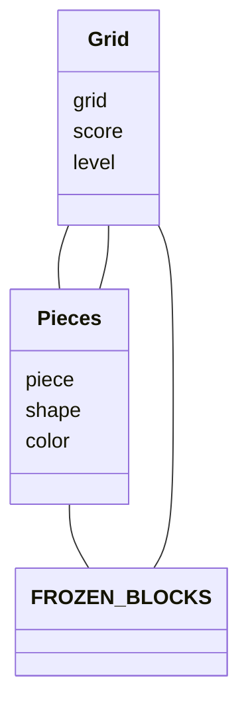
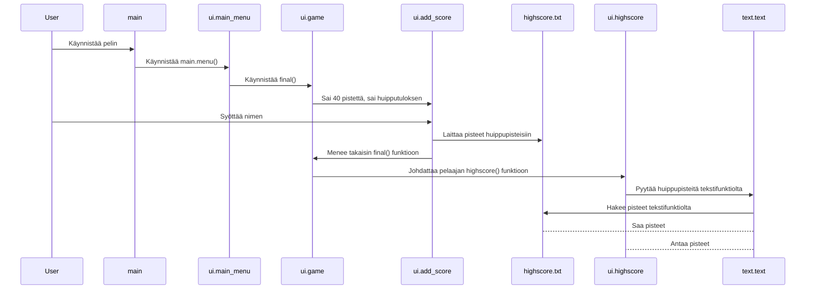

# Arkkitehtuurikuvaus

## Rakenne
Ohjelmassa on 4 kansiota sekä pääkansiossa yksi tiedosto, joka suorittaa käyttöliittymäkoodin. Käyttöliittymäkoodi sijaitsee ui-kansiossa. Ohjelmassa on myös services-tiedosto, joka sisältää pelilogiikan, variables-tiedosto, joka sisältää muuttujia, joita voi helposti muuttaa sekä text-tiedosto, joka piirtää tekstiä ui näkymiin sekä vuorovaikuttaa highscore.txt tiedoston kanssa.

## Käyttöliittymä
Käyttöliittymään kuuluu 4 erilaista näkymää
- Päävalikko
- Huippupisteet
- Tetris-peli
- Huippupisteen lisäys

Nämä ovat jokainen toteutettu omana luokkanaan omaan tiedostoon. Nämä myös ottavat text-tiedoston Text-luokasta käyttöönsä monia funktioita, jotka mm. Laittavat ruudulle tekstiä ja päivittävät huipputuloksia.

Kun pelaaja saa uuden huipputuloksen, hän laittaa huipputuloksen ylös ja tämä menee huipputuloslistalle omalle paikalleen.

## Pelilogiikka
Pelilogiikan muodostavat luokat Grid ja Pieces, jotka kuvaavat pelikenttää ja putoavia palikoita. Variablesissa on myös globaali muuttuja, FROZEN_BLOCKS, joka on avainasemassa törmäyksien kanssa.

Pieces-luokka vastaa monista palikoihin liittyvistä toiminnallisuuksista. Näihin kuuluu esimerkiksi:

- `piece.rotate()`
- `piece.left()`
- `piece.collision()`

Molemmat luokat pääsevät käsiksi moniin muuttujiin Variables-kansion kautta, kuten WINDOW_HEIGHT ja BSIZE. Variables kansio onkin injektoitu näihin.

## Tietojen pysyväistallennus

Tiedostossa tulee mukana tyhjä highscore.txt tiedosto variables-kansiossa, joka sisältää tiedot muodossa nimi,pisteet. Pistetulokset ovat siis paikallisia. Tiedostoa voi muokata halutessaan, jos haluaa muuttaa tuloksia, mutta pitää muistaa oikea formaatti ja laittaa tiedoston loppuun tyhjä rivi. Formaatti on siis

`Kalle,100`

`Ville,200`

## Päätoiminnallisuudet

Kuvataan yksi mahdollinen toimintalogiikka käyttöliittymän päätoiminnallisuuden osalta sekvenssikaaviolla

Ohessa kuvataan tilannetta, kun käyttäjä pelaa peliä ja saa huipputuloksen sekä sen syöttämistä järjestelmään. Pelaaja pelaa pelin ja syöttää nimensä, jolloin nimi menee järjestelmään. Jos pelaaja ei pääsisi top 10 listalle, ei hänen nimeään listalle laitettaisi eikä sitä edes kysyttäisi.

## Ohjelman rakenteen heikkoudet

### Käyttöliittymä

Graafista käyttöliittymää voisi kaunistaa ja siihen voisi lisätä enemmän asioita, kuten ohjeita ja kuvia.

### Koodi
Koodia olisi voinut jakauttaa järkevämmin. Kaikki piirtojutut olisi voinut laittaa omaan tiedostoonsa ja kansioon, mutta osa jäi nyt pieceen ja gridiin, sillä en lopulta keksinyt järkevää ja nopeaa tapaa saada niitä omaan luokkaansa, kun ne tarvitsivat muuttujia niistä luokista. Lisäksi jos huipputuloksia muuttaa manuaalisesti ja tekee tiedoston väärin, ohjelma kaatuu. Tämän olisi voinut korjata mm. Käyttämällä sql tietokantaa.
Mielestäni tämä oli kuitenkin ihan onnistunut siihen nähden, että tämä on ensimmäinen isompi koodausprojekti mitä olen yliopistossa tehnyt.
