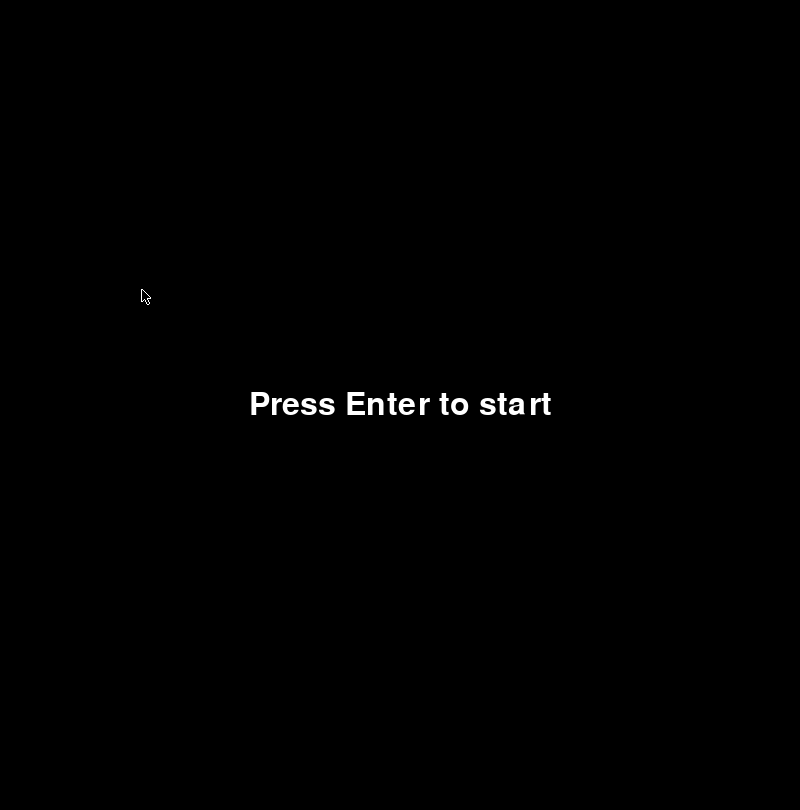
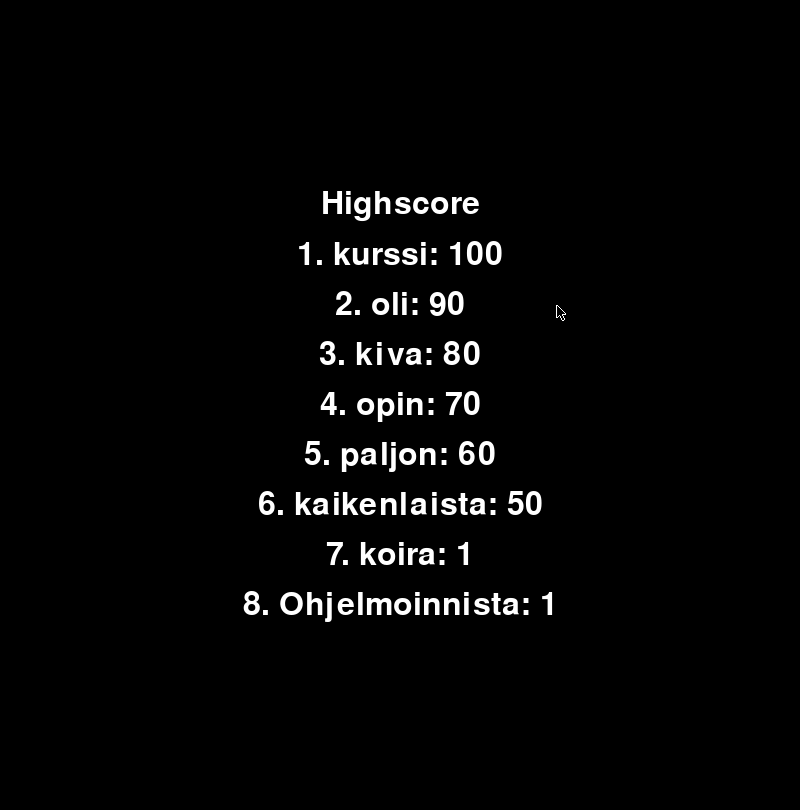
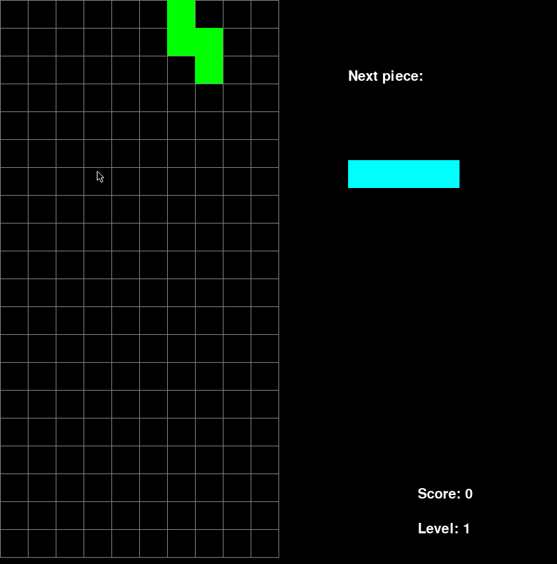
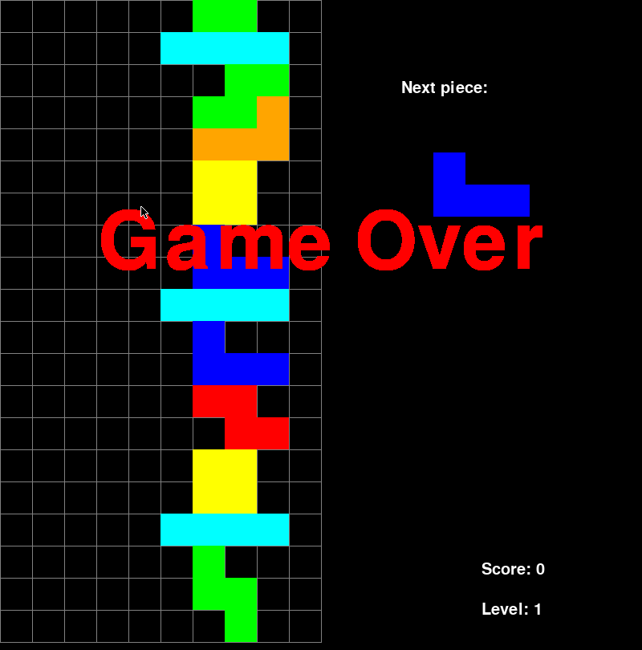

# Käyttöohje

Lataa projektin viimeisimmän releasen lähdekoodi oikealta assets-osion alta kohdasta, missä lukee _source code_.

## Ohjelman käynnistäminen

1. Asenna riippuvuudet komennolla

```
poetry install
```

2. Käynnistä peli komennolla

```
poetry run invoke start
```
##Pelin aloittaminen

Aloita peli painamalla enteriä.



Voit myös tarkistella huipputuloksia painamalla H-näppäintä. Tästä ruudukosta voi palata päävalikkoon painamalla enteriä tai esciä.




Eteesi avautuu klassinen tetris näkymä. Oikealla hudissa näkyy myös seuraava palikka, nykyinen taso sekä nykyinen pistemäärä. Taso nousee jokaisen 20 pisteen kohdalla.



Häviät pelin, kun kuutiot kasaantuvat pelin yläreunaan.



Jos tuloksesi päätyy top kymppiin, pääset top-listalle. Tällöin peli kysyy sinulta nimeä.


Lopuksi peliin aukeaa tulosnäkymä. Pelistä pääsee pois painamalla enteriä, esciä tai ruksia.


